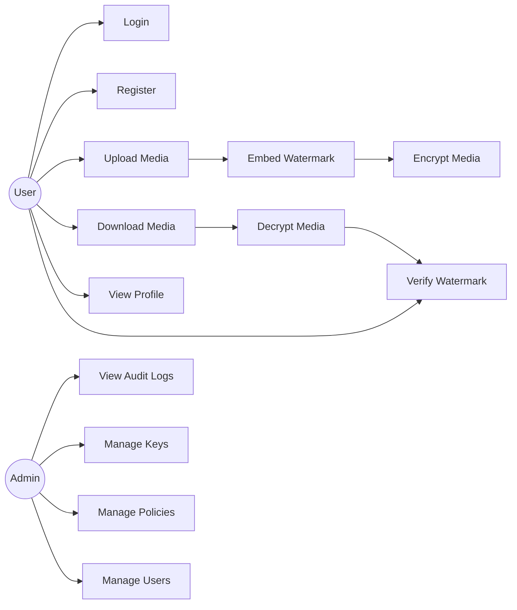
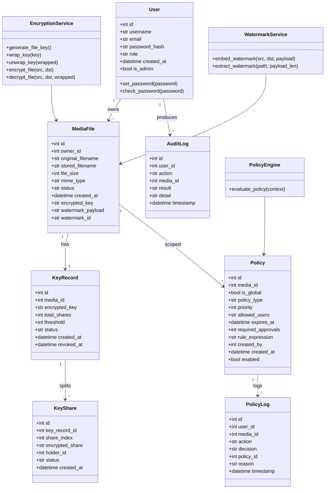
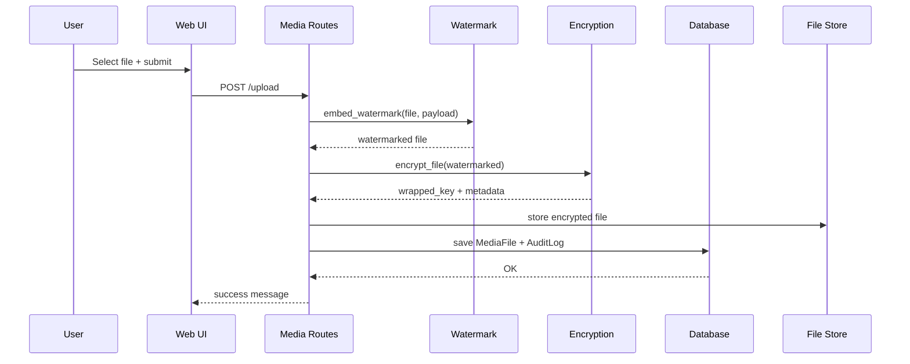
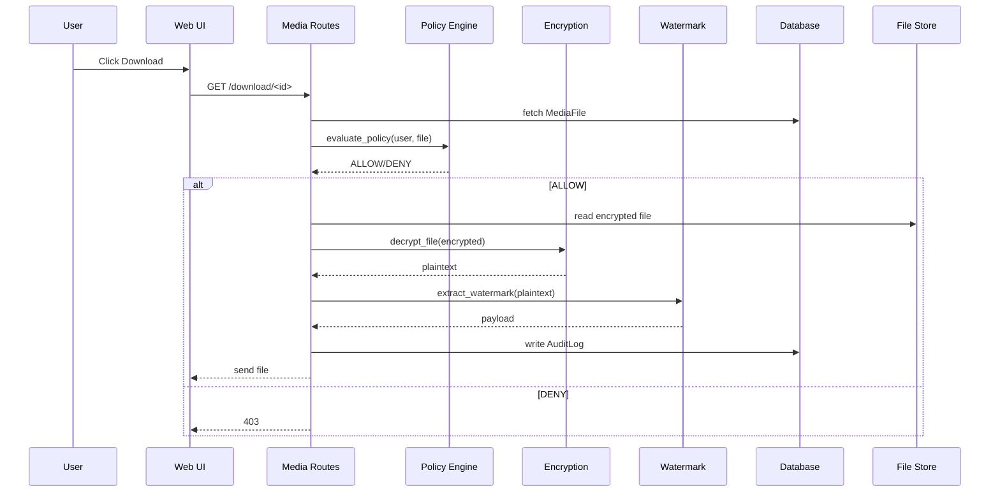
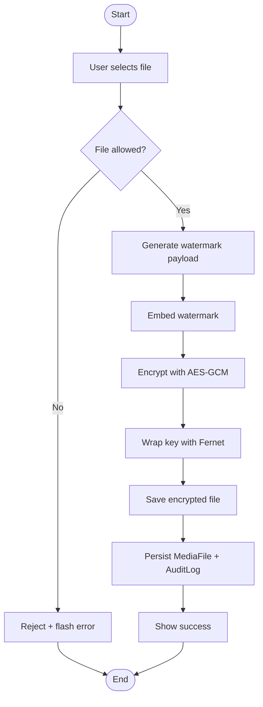

# UML Diagrams — SecureMedia

---

## 1) Use Case Diagram

---

## 2) Class Diagram (Core Models + Services)

---

## 3) Sequence Diagram (Upload → Watermark → Encrypt)

---

## 4) Sequence Diagram (Download → Policy → Decrypt → Verify)

---

## 5) Activity Diagram (End-to-End Upload Flow)

